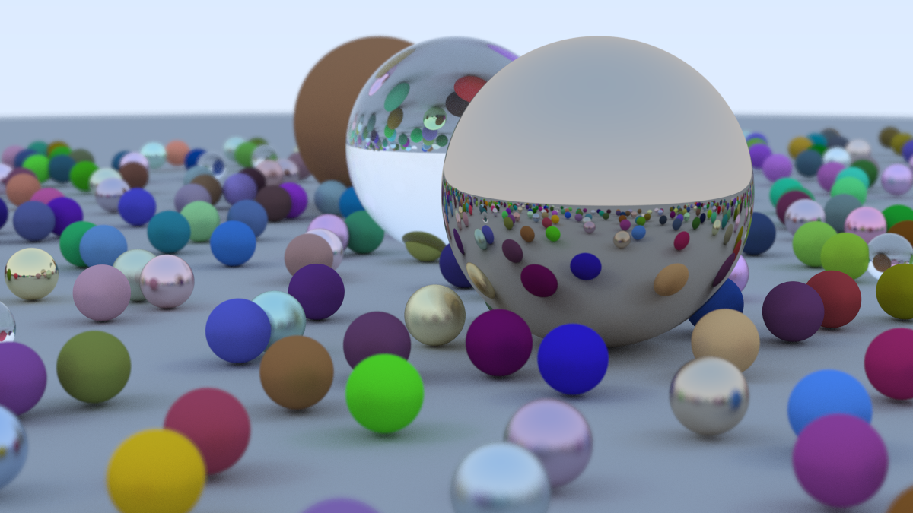

# RayTracing
 
レイトレーシングを Kotlin で実装したプログラム．

## Output

実行時間 Intel i7-1165G7

|        | time (s) |
|--------|----------|
| user   | 9187.14  |
| system | 52.61    |

## Reference

[Ray Tracing in One Weekend](https://raytracing.github.io/books/RayTracingInOneWeekend.html)